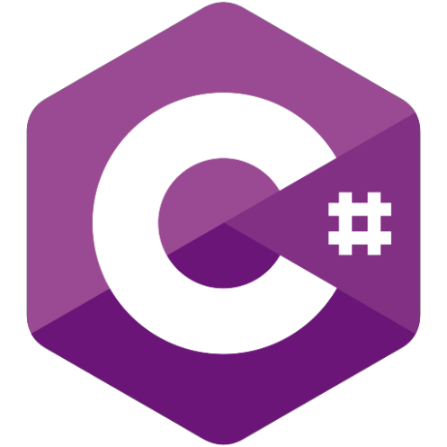

<!-- GITHUB README PROFILE -->

<!--Banner-->

 
<h2><samp><u>Hello World!👋 </u></samp></h2> 

<!--Introduction-->

<samp>
I'm Aditya, a passionate, self-taught programmer. I revel in coding a lot due to the reality that you can do ultimately anything with no barriers. Coding additionally taught me a way to examine a issue from unique perspectives; that we continually have two methods of tracking down a solution - the tough manner and the clever manner.
</samp>

<!--Github stats-->

##
### <code><u>My Github Statistics</u></code>

<!--Languages and tools-->
##
### <code><u>Languages and Tools I Use</u></code>
 

<!--Languages-->
 

 

  
 

<!--Tools-->

 

